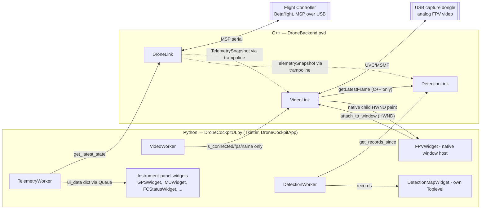
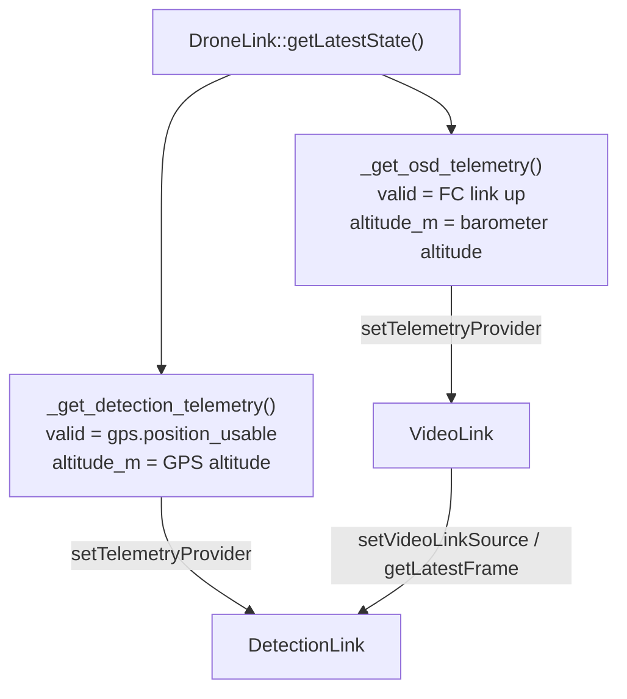

# Architecture

## 1. Process & language split

R.A.D. runs as a single Windows process:

- **C++ core**, compiled as a Python extension module `DroneBackend.pyd`
  (via pybind11). This is where every hardware-facing, latency-sensitive, or
  pixel-touching operation lives: serial I/O, video capture, GDI rendering,
  YOLO inference.
- **Python cockpit UI** (`DroneCockpitUI.py`, Tkinter — entry point
  `DroneCockpitApp`), which owns the application window, the draggable
  instrument panels, and user interaction. It never touches MSP, serial, or
  OpenCV directly — every hardware fact reaches it through the three
  pybind11 classes, described in [modules/bindings.md](modules/bindings.md)
  and, from the Python side, in [FRONTEND.md](FRONTEND.md).

The dividing line is deliberate and stated explicitly in the code comments:
**raw pixel data does not cross into Python** except through two narrow,
opt-in, low-rate exceptions: `DetectionLink::getLatestAnnotatedFrameJpeg()`
(preview pane polled at ~5–6 fps, see
[modules/detectionlink.md](modules/detectionlink.md)) and
`VideoLink::getLatestFrame()` (only called where Python genuinely needs
pixels, e.g. a future recording pipeline — the live pump in
`video_worker.py` deliberately does **not** call it, see
[FRONTEND.md](FRONTEND.md#video_workerpy)). Live video reaches the screen by
`VideoLink` painting directly into a native Win32 child window
(`attachToWindow()`), bypassing numpy/Tk image marshaling entirely.



## 2. Three independent worker threads (plus the UI thread)

Each hardware-facing class owns its own background thread and never blocks
the others:

| Thread | Owner | Cadence | Responsibility |
|---|---|---|---|
| `communicationLoop()` | `DroneLink` | 100 Hz (10 ms), configurable via `setPollIntervalMs()` | Poll the FC over MSP, parse every telemetry type, commit a `DroneState` snapshot |
| `captureLoop()` | `VideoLink` | driven by capture device FPS (~60) | Grab frames, run link-state detection, paint into the native window + OSD |
| `previewLoop()` | `DetectionLink` | fixed tick (`kPreviewTickMs`) | Republish the latest frame + most recent detection boxes, **never** runs inference |
| `inferenceLoop()` | `DetectionLink` | `detectionIntervalMs_` (default 250 ms), or slower if a pass overruns | Run YOLO, update the tracker, write `DetectionRecord`s |

The `previewLoop()` / `inferenceLoop()` split inside `DetectionLink` exists
specifically so a slow inference pass (seconds, on an unoptimized Debug
build) can never stall the live preview — see
[modules/detectionlink.md](modules/detectionlink.md#dual-thread-design).

Every cross-thread hand-off in the codebase follows the same shape: a small
mutex (or `std::atomic` for scalar/pointer state) guarding the *latest*
value, with the producer thread overwriting it and the consumer thread
copying it out — never a queue, never blocking. Examples: `DroneLink`'s
`dataMutex`/`currentState`, `VideoLink`'s `frameMutex`/`latestFrame`,
`DetectionLink`'s `boxesMutex_`/`latestBoxes_`.

The Python side mirrors this with three of its own daemon threads, one per
C++ link object, each doing only cheap/mutex-protected reads and never
touching Tk:

| Thread | Owner | Cadence | Responsibility |
|---|---|---|---|
| `TelemetryWorker._run()` | `telemetry_worker.py` | 60 Hz poll, bounded `Queue` (depth 3, oldest dropped) | Calls `DroneLink.get_latest_state()`, flattens it into a plain `ui_data` dict (`_build_ui_data()`), pushes it for the Tk thread to drain |
| `VideoWorker._loop()` | `video_worker.py` | 15 Hz (configurable) | Polls only `VideoLink.is_connected()/get_measured_fps()/get_device_name()` — **never** frame data, since the frame never needs to reach Python at all |
| `DetectionWorker._loop()` | `detection_worker.py` | 4 Hz (configurable) | Polls `DetectionLink`'s cheap counters + `get_records_since()` for incremental record delivery |

None of these three call into Tk or hold a widget reference — they hand a
plain value (dict / tuple / list) back to whichever Tk `after()`-scheduled
pump reads it. See [FRONTEND.md](FRONTEND.md#worker-threads) for each
worker's exact contract.

## 3. The "provider" decoupling pattern

`VideoLink` and `DetectionLink` know nothing about `DroneLink`, MSP, or each
other's concrete types. Instead:

- `DetectionLink::setVideoLinkSource(VideoLink*)` — the only place
  `DetectionLink` touches `VideoLink`, and only ever calls
  `getLatestFrame()` on it.
- `DetectionLink::setTelemetryProvider(std::function<TelemetrySnapshot()>)`
  and `VideoLink::setTelemetryProvider(...)` — both take a plain callable
  returning a `TelemetrySnapshot`, wired from Python (or a small C++
  trampoline) to wherever `DroneLink`'s state actually lives.

`TelemetrySnapshot` itself (the struct) is shared between `VideoLink`'s OSD
and `DetectionLink`'s georeferencing on purpose — there's no second
"telemetry type" invented for the OSD (see the comment on
`TelemetrySnapshot` in `Detectionlink.h`). It also means `DetectionLink` can
run against a recorded video file during post-flight replay by calling
`setFrameSource(std::function<cv::Mat()>)` instead of
`setVideoLinkSource()`, with zero code changes elsewhere.

**The two callables passed in are deliberately *not* the same one**, despite
what a first read of the C++ header comments suggests. On the Python side
(`DroneCockpitApp`, see [FRONTEND.md](FRONTEND.md#telemetry-trampolines)),
`_get_detection_telemetry()` and `_get_osd_telemetry()` are two separate
trampolines built from the same `DroneLink.get_latest_state()` snapshot,
because the two consumers need different validity/altitude semantics:

- `_get_detection_telemetry()` sets `valid = gps.position_usable` (no GPS
  fix ⇒ georeferencing must be skipped) and fills `altitude_m` from GPS.
- `_get_osd_telemetry()` sets `valid` to "is the FC link up at all" (the
  OSD's altitude/horizon/compass elements need no GPS fix — they come from
  the barometer, IMU, and magnetometer respectively) and fills `altitude_m`
  from the **barometer**, so the OSD's on-screen altitude agrees with
  `BaroWidget` instead of silently depending on GPS.

Reusing one trampoline for both was tried and breaks the OSD (it stays blank
on the bench / before first GPS lock). If you're wiring a new telemetry
consumer, write it a dedicated trampoline rather than assuming the existing
one's `valid` flag means what you need.



## 4. Data flow: one detection, end to end

1. `DroneLink::communicationLoop()` polls the FC, eventually producing GPS,
   attitude, and gimbal-relevant fields inside `DroneState`.
2. `VideoLink::captureLoop()` grabs a frame from the analog capture dongle.
3. `DetectionLink::inferenceLoop()` wakes up on its own cadence, pulls the
   latest frame via the wired `VideoLink*`, and a fresh `TelemetrySnapshot`
   via the telemetry provider.
4. `runInference()` produces raw pixel-space boxes; `matchRawToTracks()` +
   `updateTracks()` assign/continue track IDs so one physical object doesn't
   spam a new record every 250 ms.
5. For each detection worth recording, `computeWorldRay()` turns the pixel
   offset + camera FOV + gimbal/attitude/heading into a world-space unit
   ray, and `computeGeoCandidate()` tries ground-plane intersection,
   bearings-only triangulation, and object-size ranging (in that order of
   applicability) to turn the ray into a lat/lon.
6. The result is stored as a `DetectionRecord` (optionally with a saved
   screenshot) and becomes available to Python via `getRecordsSince()`.

See [modules/detectionlink.md](modules/detectionlink.md) for the detail of
step 4–5, including why three separate ranging strategies exist.

## 5. MSP transport summary

`DroneLink` and the FC share one 57600-baud MSP link over USB
(`MSP_BAUD` in `DroneLink.h`). GPS itself is not spoken to directly in
normal operation — the FC handles the GPS UART internally (115200 baud,
`gps_auto_config=ON`) and R.A.D. reads satellite/fix data back out over MSP
(`MSP_RAW_GPS`, `MSP_COMP_GPS`, `MSP_GPS_SV_INFO`). The only time R.A.D.
talks to the GPS module directly is `DroneLink::applyGPSConfig()`, which
uses `MSP_SET_PASSTHROUGH` to put the FC into a raw byte-forwarding mode for
one UBX configuration exchange, then must close/reopen the serial port to
force the FC back into normal MSP mode (Betaflight 4.x never exits
passthrough on its own). Full detail in
[modules/dronelink.md](modules/dronelink.md#gps-passthrough-configuration).

## 6. The Tk update loop (`DroneCockpitApp._update_loop`)

The Tk main thread runs one recurring `self.root.after(UI_REFRESH_MS, ...)`
pump. Every tick it drains `TelemetryWorker.get_frame()` (non-blocking,
returns `None` if nothing new) and, if a frame is available, feeds it to
each widget — but not every widget on every tick. A per-widget counter
dictionary (`_frame_counters` / `_THROTTLE`) divides the pump rate down per
widget so expensive widgets don't set the pace for cheap ones:

| Widget | Rate | Reasoning |
|---|---|---|
| IMU, Baro, FC Status, Arming, Mag | every tick (~50 Hz) | Cheap Tk redraws, values change fast (IMU especially) |
| FPV status/FPS text | every 5th tick (~10 Hz) | Only text — the video pixels bypass this loop entirely (see §1) |
| ADI (`Drone3DView`) | every 3rd tick (~17 Hz) | Canvas redraw with trig, a bit heavier |
| GPS (`GPSWidget`) | every 5th tick (~10 Hz) | The heaviest — map tile redraw |

The FPV status counter is updated **independently** of the telemetry
connection check — the video panel's status text must not blank out just
because the separate MSP link hiccuped or is still reconnecting; see
`_update_loop()`'s comment on this in `DroneCockpitUI.py`. Detection records
are pumped on their own separate `after()` job
(`_pump_detection_records()`), only while the detection window is actually
open — see [FRONTEND.md](FRONTEND.md#detectionmapwidgetpy).

Full widget inventory, panel-layout system, and the two telemetry
trampolines are documented in [FRONTEND.md](FRONTEND.md).

## 7. Directory reality check

All of the C++ sources currently reviewed live flat, without a `src/`/`include`
split, and the Python sources live flat alongside them (one folder,
`DroneCockpitUI/` per the paths seen in code comments):

```
Bindings.cpp
DroneLink.h / DroneLink.cpp
GPSneoM10.h / GPSneoM10.cpp
IMUSensor.h / IMUSensor.cpp
MagQMC5883L.h / MagQMC5883L.cpp
BaroBMP280.h / BaroBMP280.cpp
VideoLink.h / VideoLink.cpp
Detectionlink.h / Detectionlink.cpp

DroneCockpitUI.py          # entry point, DroneCockpitApp
telemetry_worker.py
video_worker.py
detection_worker.py
FPVWidget.py
GPSWidget.py
IMUWidget.py
MagWidget.py
BaroWidget.py
FCStatusWidget.py
ArmingWidget.py
Drone3DView.py
DetectionMapWidget.py
MapTiles.py
prefetch_tiles.py
osd_overlay_controls.py
osd_layout.json            # persisted OSD element layout
Setup_Project.py           # dependency/build-environment checker
DroneTest.py                # standalone smoke-test script (not imported by main.py)
```

This documentation set doesn't prescribe a reorganization — it documents the
code as it stands. If/when the tree gets split (e.g. `sensors/`, `link/`,
`vision/`, `widgets/`), update the module map in [README.md](README.md)
accordingly.

> **Note on `DroneTest.py`:** it calls `drone.getBatteryVoltage()` and
> `drone.getAttitude()`, which do not match the current bindings surface
> documented in [modules/bindings.md](modules/bindings.md) (`get_latest_state()`
> returning a `DroneState`, no such individual getters exist there). This
> script appears to predate the current `DroneState`-snapshot binding shape
> and is not wired into `DroneCockpitUI.py` — treat it as a stale standalone
> smoke-test, not as documentation of the current API.
