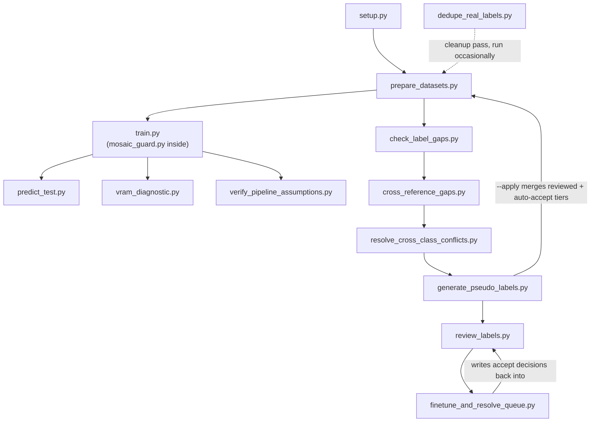

# ML Training Pipeline — index

The YOLO detection model `DetectionLink` runs (see
[modules/detectionlink.md](modules/detectionlink.md)) is trained
**separately** from the cockpit application, by a standalone pipeline of
Python scripts. This page indexes that pipeline. It's a distinct
subproject from the C++/Tkinter cockpit documented elsewhere in this repo
— these scripts have no runtime dependency on `DroneBackend.pyd` or
`DroneCockpitUI.py` at all; the only link between the two halves is the
`.onnx` file `train.py` eventually exports and `DetectionLink.set_model_path()`
loads (see [modules/detectionlink.md](modules/detectionlink.md)) and the
shared class taxonomy (`class_map.py`'s `UNIFIED_CLASSES`, which must match
whatever `.names` file sits next to that `.onnx` — see
[app-shell.md](frontend/app-shell.md) for the cockpit-side consequence of a
mismatch).

## Why this pipeline is bigger than "download data, run train.py"

Two of the three source datasets are only **partially labeled** for this
project's unified taxonomy (person / car / large_vehicle / motorcycle /
other_vehicle — see [ml-pipeline/class-map.md](ml-pipeline/class-map.md)):
UAVDT never labels people, motorcycles, or other_vehicle; SARD never labels
any vehicle class. Training naively on the union would actively punish the
model for correctly detecting a real-but-unlabeled object in those gaps,
since YOLO's loss treats every unlabeled region as confirmed background.
Most of this pipeline exists to **measure, then close, that gap** — using
four independent detector models to vote on what's actually in those
unlabeled regions, before a human ever has to look at most of it.

## Pipeline stages

1. **[setup.py](ml-pipeline/setup.md)** — one-time environment setup:
   CUDA-checked PyTorch, Ultralytics, albumentations, pre-downloads
   VisDrone, checks for manually-downloaded UAVDT/SARD.
2. **[class_map.py](ml-pipeline/class-map.md)** — the shared unified
   taxonomy every dataset gets remapped into. Read by nearly every other
   script in this pipeline.
3. **[prepare_datasets.py](ml-pipeline/prepare-datasets.md)** — downloads/
   remaps/merges VisDrone + UAVDT + SARD (+ any `datasets/external/`
   entries) into one `datasets/unified.yaml`, with sparse-class
   oversampling and pending-review exclusion.
4. **[train.py](ml-pipeline/train.md)** (with **[mosaic_guard.py](ml-pipeline/mosaic-guard.md)**
   installed into it) — the actual YOLO26 fine-tuning run, with
   WDDM/VRAM-spillover guards and a degradation-augmentation pipeline
   calibrated to the real analog FPV camera.
5. Post-training diagnostics, run as needed rather than every time:
   - **[predict_test.py](ml-pipeline/predict-test.md)** — visual sanity
     check against a real test-flight video before trusting a checkpoint
     in the air.
   - **[vram_diagnostic.py](ml-pipeline/vram-diagnostic.md)** — root-causes
     a suspected VRAM leak independent of a full training run.
   - **[verify_pipeline_assumptions.py](ml-pipeline/verify-pipeline-assumptions.md)** —
     empirically checks `train.py`/`prepare_datasets.py`'s own doc-comment
     claims against actual prepared data and installed library versions.
6. **The label-gap pipeline** — closing UAVDT/SARD's missing-class gap:
   - **[check_label_gaps.py](ml-pipeline/check-label-gaps.md)** — quantifies
     the risk with a single VisDrone-domain YOLO checkpoint.
   - **[cross_reference_gaps.py](ml-pipeline/cross-reference-gaps.md)** —
     re-scans the flagged images with **four** independent detector
     architectures and vote-clusters their detections.
   - **[resolve_cross_class_conflicts.py](ml-pipeline/resolve-cross-class-conflicts.md)** —
     merges same-object clusters that landed under two different class
     labels, so they aren't queued for review twice.
   - **[generate_pseudo_labels.py](ml-pipeline/generate-pseudo-labels.md)** —
     tiers the vote-clustered candidates into auto-accept / needs-review /
     discarded, and merges the auto-accept tier into the real dataset.
   - **[review_labels.py](ml-pipeline/review-labels.md)** — the interactive
     Tkinter GUI a human uses to clear the needs-review queue.
   - **[finetune_and_resolve_queue.py](ml-pipeline/finetune-and-resolve-queue.md)** —
     once enough images are hand-reviewed, fine-tunes two fresh models on
     that hand-reviewed set and uses them as two new voters to
     auto-resolve as much of the remaining backlog as the data actually
     supports — writing decisions back into `review_labels.py`'s own
     progress file.
   - **[dedupe_real_labels.py](ml-pipeline/dedupe-real-labels.md)** — a
     one-off cleanup script for a specific historical double-labeling bug
     in an early merge.

## Cross-cutting notes

- **Everything is resumable / re-runnable.** Nearly every script in this
  list either checks whether its work is already done before redoing it
  (`prepare_datasets.py`, `setup.py`) or writes its full state to disk so
  it can be closed and reopened without losing progress
  (`review_labels.py`'s autosave, `train.py`'s `--resume`).
- **Dry-run-by-default is a running pattern.** `dedupe_real_labels.py`,
  `generate_pseudo_labels.py`, `finetune_and_resolve_queue.py`, and
  `resolve_cross_class_conflicts.py` all default to reporting what
  *would* change and require an explicit flag (`--apply` / `--yes`) to
  actually write anything.
- **Everything discarded is recorded, not silently dropped.** Confidence
  floors, dedup thresholds, and review-queue tiering all write out a JSON
  report of what got excluded and why, specifically so a threshold can be
  retuned later without re-running the expensive model-scanning step.
- **This pipeline targets a 6GB laptop GPU** (an RTX 3060) throughout —
  `train.py`'s WDDM-spillover guards, `mosaic_guard.py`'s instance cap,
  and `cross_reference_gaps.py`'s phase-loaded (one model at a time)
  execution all exist specifically because of that constraint, not as
  generic best practice.
