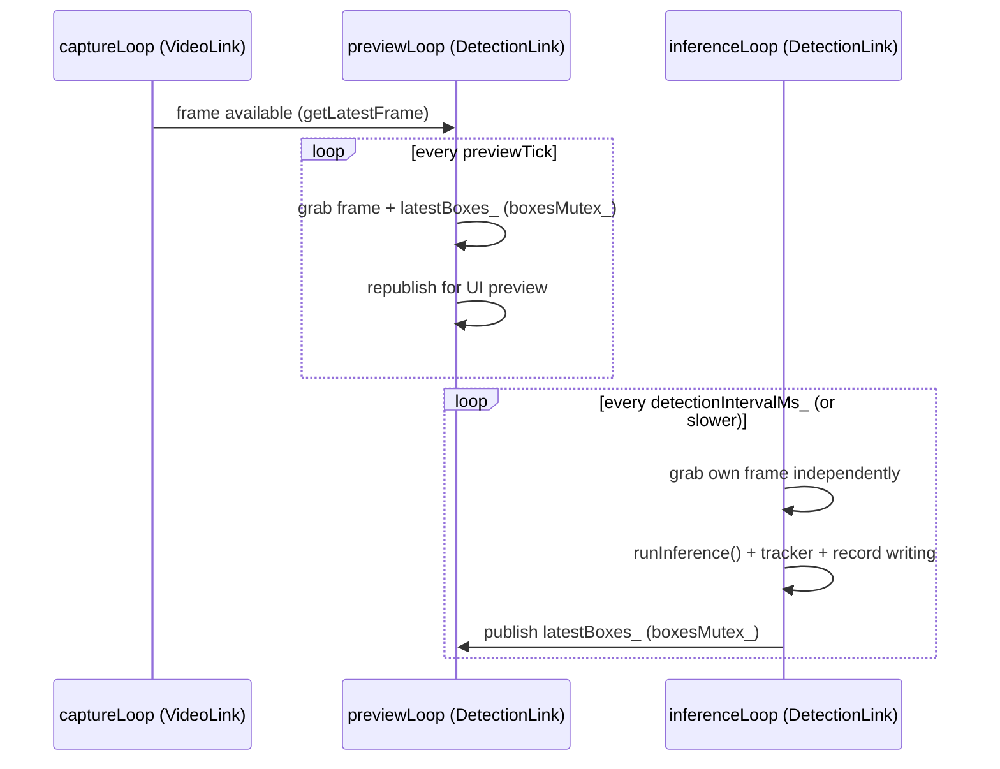

# `DetectionLink` — YOLO detection, tracking & georeferencing

**Files:** `Detectionlink.h`, `Detectionlink.cpp`
**Depends on:** OpenCV `dnn` (ONNX inference), `VideoLink` (frame source
only, via pointer — see the provider pattern), a telemetry provider
callable
**Exposed to Python as:** `DroneBackend.DetectionLink` (see
[bindings.md](bindings.md#detectionlink))

## Responsibility

Runs a YOLO object-detection model against the live video feed, tracks
detections across passes so one physical object produces one evolving
record instead of a flood of near-duplicates, and turns each worthwhile
detection into a georeferenced `DetectionRecord` (a map pin) using whichever
of three ranging strategies fits the situation.

## Wiring (decoupled sources)

- `setVideoLinkSource(VideoLink*)` — preferred. `DetectionLink` does not
  take ownership and calls nothing on the pointer except
  `getLatestFrame()`. Pixel data never crosses into Python via this path.
- `setFrameSource(std::function<cv::Mat()>)` — escape hatch for testing, or
  for a non-`VideoLink` frame source such as a recorded file during
  post-flight replay.
- `setTelemetryProvider(std::function<TelemetrySnapshot()>)` — called once
  per detection pass, immediately before inference, so the snapshot is as
  time-close to the frame as practical.

See [ARCHITECTURE.md](../ARCHITECTURE.md#3-the-provider-decoupling-pattern)
for why this is structured as callables rather than concrete dependencies.

## Configuration surface (call before `start()`, most are safe at runtime)

| Setter | Default | Purpose |
|---|---|---|
| `setModelPath(path)` | — | ONNX model path. Expects Ultralytics end-to-end/NMS-baked export layout (`[1, maxDetections, 6]` — confidence/class already resolved, NMS already applied in-graph). A sibling `.names` file (same stem) is auto-loaded for class labels; otherwise classes read as `class_N` |
| `setScreenshotDir(dir)` | empty (disabled) | Where detection screenshots are written; detections are still recorded without one if left empty |
| `setHorizontalFovDeg(fov)` | 90.0 | Camera horizontal FOV — must match the camera's real datasheet FOV, same assumption used for `VideoLink`'s capture config |
| `setDetectionIntervalMs(ms)` | 250 | Detection-pass cadence, independent of the ~30–60 fps capture loop |
| `setConfidenceThreshold(t)` | 0.4 | Raw model confidence floor, applied before a detection becomes a `DetectionRecord` |
| `setInputSize(size)` | 640 | Square letterboxed input side. **Must match the ONNX export's `imgsz`**, not necessarily the training `imgsz` — mismatch silently scales every box wrong with no crash. `yolo_main_run` was trained at 960; if exported at 960, call `setInputSize(960)` |
| `setUseCuda(enabled)` / `isUsingCuda()` | false | Opt into CUDA backend/target; needs an OpenCV build with CUDA support (stock pip/vcpkg wheels lack it). Falls back to CPU silently if unavailable — check `isUsingCuda()` after `start()` |
| `setKnownObjectWidth(class, meters)` / `clearKnownObjectWidths()` | none set | Real-world face-on width per class, enabling object-size ranging for that class (see below) |
| `setMinGroundRayComponent(v)` | 0.12 (~7°) | Below this ray-downward-component, ground-plane ranging is distrusted in favor of object-size ranging (or used as a last resort if unavailable) |
| `setTriangulationMinBaselineM(m)` | 5.0 | Minimum drone movement between bearing observations before a triangulated fix is trusted |
| `setTriangulationMinBearingSpreadDeg(deg)` | 5.0 | Minimum angular spread between bearing observations — guards the "moved far but flew straight at the object" degenerate case |
| `setTrackIouThreshold(v)` | 0.3 | Minimum IoU (same class) to match a raw detection to an existing track |
| `setTrackMaxMissedPasses(n)` | 6 (~1.5 s at 250 ms) | Passes a track survives unmatched before being dropped |
| `setTrackMoveThresholdM(m)` | 3.0 | Ground movement needed before a continuing track gets a fresh `DetectionRecord` |
| `setTrackRefreshIntervalMs(ms)` | 10000 | Even a static, continuously-tracked object gets a periodic fresh record so it doesn't look stale |

## Dual-thread design

- **`previewLoop()`** grabs a frame and republishes it — annotated with
  whatever boxes `inferenceLoop()` most recently finished — strictly on the
  fixed `kPreviewTickMs` cadence. It **never** calls `runInference()`, so it
  can never be blocked by it regardless of how slow a given
  model/build/hardware combination makes one forward pass. This is what
  gives the live preview pane the video feed's own responsiveness
  *structurally*, rather than depending on inference staying fast — the old
  single-thread version depended on exactly that assumption and broke badly
  on an unoptimized Debug build, where a several-second `runInference()`
  call blocked frame grab + republish for its entire duration.
- **`inferenceLoop()`** grabs its own frame independently, runs the model +
  tracker + record-writing at `detectionIntervalMs_` cadence (or however
  long a pass actually takes, if longer), and publishes only the resulting
  boxes for `previewLoop` to pick up.
- The two threads never block on each other beyond the brief
  `boxesMutex_` critical section.

## Object tracking / re-identification

Without a tracker, a car sitting in frame for 10 seconds at 4 passes/sec
(the default 250 ms interval) produced 40 near-identical
`DetectionRecord`s and screenshots. The tracker is deliberately lightweight:
**position-only re-identification** — it matches each pass's raw boxes
against the previous pass's tracked boxes by IoU + same class, **not** by
any learned appearance embedding.

Consequences of that design choice, stated directly in the code:

- Reliable for an object continuously visible pass-to-pass (consecutive-pass
  boxes overlap heavily at 4 Hz).
- **Cannot** re-identify an object that leaves frame and returns later, or
  two same-class objects that cross paths — both become distinct tracks
  (new `trackId`). True appearance re-ID would need an embedding model and
  is explicitly out of scope.

Flow per pass:

1. `matchRawToTracks(rawDetections)` — pure/read-only greedy IoU+class
   matching against `tracks_` as they stood at the end of the *previous*
   pass. No mutation, no new tracks. Factored out specifically so
   `inferenceLoop()` can look up an existing track's `bearingHistory` (for
   triangulation, via `computeGeoCandidate()`) **before** `updateTracks()`
   mutates anything — both call sites use this exact function, so the
   "preview" match used for history lookup is guaranteed identical to the
   "real" match `updateTracks()` commits.
2. `updateTracks(...)` — updates `tracks_` in place using the already-computed
   match indices (position, `bearingHistory`, missed-pass aging), ages out
   tracks past `trackMaxMissedPasses_`, and returns a `TrackAssignment`
   (trackId + `shouldRecord`) per raw detection. A brand-new track is always
   recorded; a continuing track is recorded only once it has moved
   `trackMoveThresholdM_` or `trackRefreshIntervalMs_` has elapsed since its
   last record.

`Track.bearingHistory` accumulates a `BearingObservation` on **every** pass
a track is seen — matched or freshly created — regardless of whether that
pass's own ranging succeeded. This means a string of un-ranged
forward-flight sightings still builds up useful parallax for
`rangeByTriangulation()` once the drone has moved enough (capped at
`kMaxBearingHistoryPerTrack` in the `.cpp`).

## Georeferencing: three ranging strategies

All three consume the same world-space ray, built once per raw detection:

`computeWorldRay(raw, frameW, frameH, telemetry, ...)` composes the pixel
offset + horizontal FOV into a camera-space ray, then applies gimbal
pan/tilt, then body roll/pitch/heading — shared by every ranging method so
they always agree on *direction* and only differ on how far along that
direction the object actually is. Angle conventions (documented explicitly
because getting one wrong offsets every pin consistently and
easy-to-miss, the same class of bug as `MagQMC5883L`'s historical
`atan2(y,x)` vs `atan2(x,y)` swap):

- `headingDeg` — compass heading, 0 = north, increasing clockwise
- `rollDeg` — positive = right wing down
- `pitchDeg` — positive = nose up
- `gimbalPanDeg` — relative to body forward, positive = pan right
- `gimbalTiltDeg` — 0 = forward/level, +90° = straight down

| Strategy | Method | Needs | Strength | Weakness |
|---|---|---|---|---|
| **Ground-plane intersection** | `rangeByGroundPlane()` | Altitude (AGL) + attitude + gimbal | Simple, works well when the gimbal is steeply downward and altitude is trustworthy | Degrades sharply as the ray flattens toward the horizon — small altitude/attitude error → huge range error (guarded by `setMinGroundRayComponent()`) |
| **Bearings-only triangulation** | `rangeByTriangulation()` | Accumulated `BearingObservation` history for the same track + the current ray | Least-squares fit; needs **no** assumed object size and **no** altitude trust at all | Degenerates (returns invalid) with only one sighting, or when the drone flew straight at the object with no lateral offset (no real parallax) — guarded by `setTriangulationMinBaselineM()` and `setTriangulationMinBearingSpreadDeg()` |
| **Apparent object size** | `rangeByObjectSize()` | A registered real-world width for that class (`setKnownObjectWidth()`) | `distance = (known width × focal length px) / (bbox width px)` — pinhole model; independent of altitude entirely, works at any gimbal angle including straight-ahead FPV shots | Only as accurate as the assumed real-world width and how face-on the object is viewed; only available for registered classes |

`computeGeoCandidate()` tries these and picks a result rather than the
first one found silently winning — this is why `RangeEstimate` carries a
`method` string (`"ground_plane"`, `"triangulated"`, `"object_size"`) that
ends up on every `DetectionRecord.rangeMethod`, so a reviewer can tell how
much to trust a given pin.

Flat-earth assumption is used throughout (`rangeByGroundPlane`) — explicitly
called out as fine at the few-km ranges this is designed for, with a DEM
lookup left as a possible future addition if slope error starts to matter.

## `TelemetrySnapshot` and `DetectionRecord`

`TelemetrySnapshot` (defined here, shared with `VideoLink`'s OSD — see
[videolink.md](videolink.md#software-osd-overlay)) carries position,
attitude, gimbal angles, and a set of OSD-only fields (battery, RSSI, GPS
fix/sat count, home distance, ground speed, armed) that `DetectionLink`
itself never reads — they ride along purely because `VideoLink` reuses this
one struct instead of inventing a second telemetry type.

`DetectionRecord` is the map-pin record: identity (`id`, `trackId`),
timing, class/confidence, pixel-space box (kept so a screenshot can be
re-cropped or the ray re-derived later), lat/lon + `georeferenced` flag,
`rangeMethod`/`distanceM`/`bearingDeg`, an optional `screenshotPath`, and
the full `telemetry` snapshot stored verbatim for later re-derivation or
debugging.

## Live preview exception

`getLatestAnnotatedFrameJpeg()` JPEG-encodes the most recent processed
frame with detections drawn on it. This is a **deliberate, narrow**
exception to the "raw pixel data never crosses into Python" rule — intended
only to feed an optional, low-rate (poll at ~1–3 Hz) preview pane, **not**
the pilot's primary video path (that stays on `VideoLink`/its native
render window exactly as documented in [videolink.md](videolink.md)).
Costs one JPEG encode per call — not meant to be polled per-tick.

## Reading detection results from Python

- `getAllRecords()` — full copy of every record since `start()` or the last
  `clearRecords()`. Mutex-protected; fine at UI refresh rate (a few Hz),
  not meant to be called every frame.
- `getRecordsSince(sinceId)` — incremental poll (pass 0 for everything) so
  the UI doesn't have to re-render the whole pin list every tick.
- `getDetectionCount()`, `getLastPassDurationMs()`,
  `getLastPassTimestampMs()` — cheap atomics, safe to poll at UI rate.
