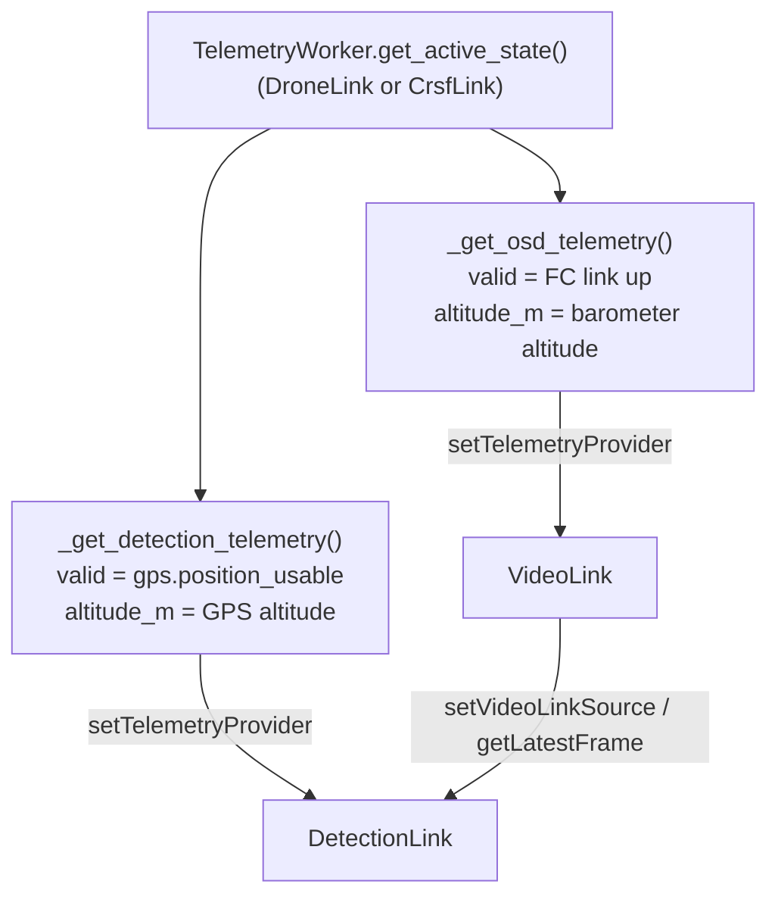

# Architecture

## 1. Process & language split

R.A.D. runs as a single Windows process:

- **C++ core**, compiled as a Python extension module `DroneBackend.pyd`
  (via pybind11). This is where every hardware-facing, latency-sensitive, or
  pixel-touching operation lives: serial I/O (MSP over USB and CRSF
  telemetry over the ELRS radio), video capture, GDI rendering, YOLO
  inference.
- **Python cockpit UI** (`DroneCockpitUI.py`, Tkinter — entry point
  `DroneCockpitApp`), which owns the application window, the draggable
  instrument panels, and user interaction. It never touches MSP, serial, or
  OpenCV directly — every hardware fact reaches it through the pybind11
  link classes, described in [modules/bindings.md](modules/bindings.md)
  and, from the Python side, in [FRONTEND.md](FRONTEND.md).

The dividing line is deliberate and stated explicitly in the code comments:
**raw pixel data does not cross into Python** except through two narrow,
opt-in, low-rate exceptions: `DetectionLink::getLatestAnnotatedFrameJpeg()`
(preview pane polled at ~5–6 fps, see
[modules/detectionlink.md](modules/detectionlink.md)) and
`VideoLink::getLatestFrame()` (only called where Python genuinely needs
pixels, e.g. a future recording pipeline — the live pump in
`video_worker.py` deliberately does **not** call it, see
[frontend/workers.md](frontend/workers.md#video_workerpy--videoworker)). Live video reaches the screen by
`VideoLink` painting directly into a native Win32 child window
(`attachToWindow()`), bypassing numpy/Tk image marshaling entirely.

```mermaid
flowchart LR
    subgraph Python["Python — DroneCockpitUI.py (Tkinter, DroneCockpitApp)"]
        TW[TelemetryWorker]
        VW[VideoWorker]
        DW[DetectionWorker]
        Widgets[Instrument-panel widgets\nGPSWidget, IMUWidget, FCStatusWidget, ...]
        FPV[FPVWidget - native window host]
        MAP[DetectionMapWidget - own Toplevel]
    end
    subgraph CPP["C++ — DroneBackend.pyd"]
        DL[DroneLink]
        CL[CrsfLink]
        VL[VideoLink]
        DTL[DetectionLink]
    end
    FC[[Flight Controller\nBetaflight, MSP over USB]]
    RADIO[[RadioMaster Pocket\nELRS TX, USB-VCP Telem Mirror]]
    RI[RadioLinkIndicator - toolbar]
    CAM[[USB capture dongle\nanalog FPV video]]

    TW -- get_latest_state --> DL
    TW -- get_latest_state --> CL
    TW -- get_link_status dict --> RI
    RADIO -- CRSF over USB CDC, listen-only --> CL
    FC -. CRSF telemetry over ELRS 2.4 GHz .-> RADIO
    TW -- ui_data dict via Queue --> Widgets
    VW -- is_connected/fps/name only --> VL
    DW -- get_records_since --> DTL
    DW -- records --> MAP
    FPV -- attach_to_window (HWND) --> VL
    DL <-- MSP serial --> FC
    VL <-- UVC/MSMF --> CAM
    VL -- getLatestFrame (C++ only) --> DTL
    TW -. active DroneState via trampoline .-> VL
    TW -. active DroneState via trampoline .-> DTL
    VL -- native child HWND paint --> FPV
```

## 2. Three independent worker threads (plus the UI thread)

Each hardware-facing class owns its own background thread and never blocks
the others:

| Thread | Owner | Cadence | Responsibility |
|---|---|---|---|
| `communicationLoop()` | `DroneLink` | 100 Hz (10 ms), configurable via `setPollIntervalMs()` | Poll the FC over MSP, parse every telemetry type, commit a `DroneState` snapshot |
| `workerLoop()` | `CrsfLink` | continuous read (≤ 20 ms per `ReadFile`), status refresh 10 Hz | Find/re-find the RadioMaster Pocket, parse CRSF frames, map them into its own `DroneState`, compute link status — see [modules/crsflink.md](modules/crsflink.md) |
| `captureLoop()` | `VideoLink` | driven by capture device FPS (~60) | Grab frames, run link-state detection, paint into the native window + OSD |
| `previewLoop()` | `DetectionLink` | fixed tick (`kPreviewTickMs`) | Republish the latest frame + most recent detection boxes, **never** runs inference |
| `inferenceLoop()` | `DetectionLink` | `detectionIntervalMs_` (default 250 ms), or slower if a pass overruns | Run YOLO, update the tracker, write `DetectionRecord`s |

The `previewLoop()` / `inferenceLoop()` split inside `DetectionLink` exists
specifically so a slow inference pass (seconds, on an unoptimized Debug
build) can never stall the live preview — see
[modules/detectionlink.md](modules/detectionlink.md#dual-thread-design).

Every cross-thread hand-off in the codebase follows the same shape: a small
mutex (or `std::atomic` for scalar/pointer state) guarding the *latest*
value, with the producer thread overwriting it and the consumer thread
copying it out — never a queue, never blocking. Examples: `DroneLink`'s
`dataMutex`/`currentState`, `VideoLink`'s `frameMutex`/`latestFrame`,
`DetectionLink`'s `boxesMutex_`/`latestBoxes_`.

The Python side mirrors this with three of its own daemon threads (the
telemetry one serves both telemetry links), each doing only cheap/mutex-protected reads and never
touching Tk:

| Thread | Owner | Cadence | Responsibility |
|---|---|---|---|
| `TelemetryWorker._run()` | `telemetry_worker.py` | 60 Hz poll, bounded `Queue` (depth 3, oldest dropped) | Picks the live source (USB `DroneLink` or ELRS `CrsfLink`), flattens its `DroneState` into a plain `ui_data` dict (`_build_ui_data()`), pushes it for the Tk thread to drain, and publishes a link-status dict for the toolbar |
| `VideoWorker._loop()` | `video_worker.py` | 15 Hz (configurable) | Polls only `VideoLink.is_connected()/get_measured_fps()/get_device_name()` — **never** frame data, since the frame never needs to reach Python at all |
| `DetectionWorker._loop()` | `detection_worker.py` | 4 Hz (configurable) | Polls `DetectionLink`'s cheap counters + `get_records_since()` for incremental record delivery |

None of these three call into Tk or hold a widget reference — they hand a
plain value (dict / tuple / list) back to whichever Tk `after()`-scheduled
pump reads it. See [frontend/workers.md](frontend/workers.md) for each
worker's exact contract.

## 3. The "provider" decoupling pattern

`VideoLink` and `DetectionLink` know nothing about `DroneLink`, MSP, or each
other's concrete types. Instead:

- `DetectionLink::setVideoLinkSource(VideoLink*)` — the only place
  `DetectionLink` touches `VideoLink`, and only ever calls
  `getLatestFrame()` on it.
- `DetectionLink::setTelemetryProvider(std::function<TelemetrySnapshot()>)`
  and `VideoLink::setTelemetryProvider(...)` — both take a plain callable
  returning a `TelemetrySnapshot`, wired from Python (or a small C++
  trampoline) to wherever `DroneLink`'s state actually lives.

`TelemetrySnapshot` itself (the struct) is shared between `VideoLink`'s OSD
and `DetectionLink`'s georeferencing on purpose — there's no second
"telemetry type" invented for the OSD (see the comment on
`TelemetrySnapshot` in `Detectionlink.h`). It also means `DetectionLink` can
run against a recorded video file during post-flight replay by calling
`setFrameSource(std::function<cv::Mat()>)` instead of
`setVideoLinkSource()`, with zero code changes elsewhere.

**The two callables passed in are deliberately *not* the same one**, despite
what a first read of the C++ header comments suggests. On the Python side
(`DroneCockpitApp`, see [frontend/app-shell.md](frontend/app-shell.md#telemetry-trampolines)),
`_get_detection_telemetry()` and `_get_osd_telemetry()` are two separate
trampolines built from the same `TelemetryWorker.get_active_state()`
snapshot (USB or ELRS, whichever currently feeds the instruments),
because the two consumers need different validity/altitude semantics:

- `_get_detection_telemetry()` sets `valid = gps.position_usable` (no GPS
  fix ⇒ georeferencing must be skipped) and fills `altitude_m` from GPS.
- `_get_osd_telemetry()` sets `valid` to "is the FC link up at all" (the
  OSD's altitude/horizon/compass elements need no GPS fix — they come from
  the barometer, IMU, and magnetometer respectively) and fills `altitude_m`
  from the **barometer**, so the OSD's on-screen altitude agrees with
  `BaroWidget` instead of silently depending on GPS.

Reusing one trampoline for both was tried and breaks the OSD (it stays blank
on the bench / before first GPS lock). If you're wiring a new telemetry
consumer, write it a dedicated trampoline rather than assuming the existing
one's `valid` flag means what you need.



## 3a. Two telemetry sources — USB cable and ELRS radio

The cockpit can receive flight-controller telemetry two ways, and both
produce the **same** `DroneState` struct:

| Source | C++ class | Transport | Data set |
|---|---|---|---|
| `"USB"` | `DroneLink` | MSP polled over the USB-C cable | Everything (raw IMU/mag, motors, RC, satellite list, HDOP, arming flags, …) |
| `"ELRS"` | `CrsfLink` | CRSF telemetry: FC → RP4TD RX → ELRS 2.4 GHz → RadioMaster Pocket → USB-VCP "Telem Mirror" → laptop (listen-only) | Attitude, battery, GPS (no HDOP/fix type), baro/vario, flight mode, link statistics |

`TelemetryWorker._pick_source()` chooses every poll: a healthy USB link
wins, otherwise a live ELRS link, otherwise a connected-but-unhealthy USB
link, otherwise nothing. `DroneState.linkSource` and the `available_*`
keys tell widgets what the current source can provide. The two links find
their own ports without interfering: `auto_detect_fc()` needs an MSP reply
and skips the radio, `CrsfLink` never opens a port named
Betaflight/INAV, and each side excludes the other's port (see
[modules/serial-port-scan.md](modules/serial-port-scan.md)).

When the radio link is lost, nothing is cleared: the last known values,
especially the last GPS position, stay on screen and on the detection map.

Every instrument adapts to the active link through `link_mode.py`. Data
the radio doesn't carry shows a grey "USB" placeholder instead of a zero,
old data is marked STALE, and the arming checklist never claims READY TO
ARM for checks it can't verify. See
[frontend/link-mode.md](frontend/link-mode.md). The IMU, Magnetometer and
FC Status panels also have a dedicated radio face (attitude & link quality,
heading & home, flight & ELRS link). All three swap in place about 1 s
after the source changes, without moving any panel. See
[frontend/dual-layer.md](frontend/dual-layer.md).

The link is **drone → laptop only** today. Commands from the laptop to
the drone (gimbal, emergency RTH, movement) are a design proposal in
[modules/command-uplink.md](modules/command-uplink.md).

## 4. Data flow: one detection, end to end

1. `DroneLink` (USB, MSP) or `CrsfLink` (ELRS radio) keeps a `DroneState`
   with GPS, attitude, heading and altitude relative to the arming point.
   The cockpit's `_get_detection_telemetry()` turns whichever link is
   active into a `TelemetrySnapshot`. The camera tilt/pan comes from the
   📐 toolbar setting, because the gimbal doesn't report it yet.
2. `VideoLink::captureLoop()` grabs a frame from the analog capture dongle
   and paints it into the pilot's FPV window. It's an `ABOVE_NORMAL` thread
   and is never blocked by detection (see the "Protecting the live video"
   section in [modules/detectionlink.md](modules/detectionlink.md)).
3. `DetectionLink::inferenceLoop()` (`BELOW_NORMAL`, duty-cycle limited)
   wakes on its own cadence, pulls the latest frame and a fresh
   `TelemetrySnapshot`.
4. `runDetection()` runs the YOLO26m model, on the full frame and,
   optionally, four overlapping tiles. `trk::ObjectTracker` then keeps one
   identity per physical object: it compensates for camera motion, predicts
   motion, matches by appearance, groups vehicle classes and confirms new
   tracks before recording them. A parked car stays **one** track.
5. For confirmed objects, `computeWorldRay()` turns pixel + FOV + camera
   angle + attitude/heading into a world ray. `computeGeoCandidate()` tries
   ground-plane, triangulation and object-size ranging, with a **coarse**
   bearing + rough-distance fallback, and attaches an uncertainty radius.
   The sightings of each object are fused into one position whose radius
   shrinks over time.
6. A `DetectionRecord` (fused lat/lon, `uncertainty_m`, `sightings`,
   `best_confidence`, screenshot) is written for a new object, when it has
   moved, and as a periodic refresh. Python reads it via
   `getRecordsSince()`. The copilot's `DetectionMapWidget` shows **one row
   and one pin with a radius circle per object**.

See [modules/detectionlink.md](modules/detectionlink.md) for steps 3–6
and [frontend/detection-map-widget.md](frontend/detection-map-widget.md)
for the copilot view.

## 5. MSP transport summary

`DroneLink` and the FC share one 57600-baud MSP link over USB
(`MSP_BAUD` in `DroneLink.h`). GPS itself is not spoken to directly in
normal operation — the FC handles the GPS UART internally (115200 baud,
`gps_auto_config=ON`) and R.A.D. reads satellite/fix data back out over MSP
(`MSP_RAW_GPS`, `MSP_COMP_GPS`, `MSP_GPS_SV_INFO`). The only time R.A.D.
talks to the GPS module directly is `DroneLink::applyGPSConfig()`, which
uses `MSP_SET_PASSTHROUGH` to put the FC into a raw byte-forwarding mode for
one UBX configuration exchange, then must close/reopen the serial port to
force the FC back into normal MSP mode (Betaflight 4.x never exits
passthrough on its own). Full detail in
[modules/dronelink.md](modules/dronelink.md#gps-passthrough-configuration).

## 6. The Tk update loop (`DroneCockpitApp._update_loop`)

The Tk main thread runs one recurring `self.root.after(UI_REFRESH_MS, ...)`
pump. Every tick it drains `TelemetryWorker.get_frame()` (non-blocking,
returns `None` if nothing new) and, if a frame is available, feeds it to
each widget — but not every widget on every tick. A per-widget counter
dictionary (`_frame_counters` / `_THROTTLE`) divides the pump rate down per
widget so expensive widgets don't set the pace for cheap ones:

| Widget | Rate | Reasoning |
|---|---|---|
| ADI (`Drone3DView`) | every 2nd tick (25 Hz) | Primary flight instrument — smooth attitude |
| IMU, Baro | every 2nd tick (25 Hz) | Values change fast |
| Mag / Heading & Home | every 3rd tick (~17 Hz) | Redraws only when the heading moves |
| FC Status, GPS | every 5th tick (10 Hz) | Text a human reads; map redraw batched |
| Arming | every 10th tick (5 Hz) | Pre-flight checklist |
| FPV status/FPS text | every 5th tick (10 Hz) | Only text — the video pixels bypass this loop entirely (see §1) |

The pump is fixed-rate and always leaves Tk idle time for repaints. The
measurements and the rules that keep the UI responsive are in
[frontend/ui-performance.md](frontend/ui-performance.md).

The FPV status counter is updated **independently** of the telemetry
connection check — the video panel's status text must not blank out just
because the separate MSP link hiccuped or is still reconnecting; see
`_update_loop()`'s comment on this in `DroneCockpitUI.py`. Detection records
are pumped on their own separate `after()` job
(`_pump_detection_records()`), only while the detection window is actually
open — see [frontend/detection-map-widget.md](frontend/detection-map-widget.md).

Full widget inventory, panel-layout system, and the two telemetry
trampolines are documented in [FRONTEND.md](FRONTEND.md).

## 7. Directory layout

```
Project R.A.D/
├── README.md                    # project overview → links into docs/
├── docs/                        # this documentation set
│   ├── README.md                # documentation index / reading order
│   ├── ARCHITECTURE.md
│   ├── FRONTEND.md              # index of frontend/ pages
│   ├── modules/                 # one page per C++ unit
│   └── frontend/                # one page per Python module
├── Project R.A.D.slnx           # Visual Studio solution
├── DroneBackend/                # C++ → DroneBackend.pyd (pybind11), flat
│   ├── Bindings.cpp
│   ├── DroneLink.h/.cpp         # MSP over USB + DroneState / RadioLinkStats
│   ├── CrsfLink.h/.cpp          # ELRS telemetry link (Win32 serial, thread)
│   ├── CrsfProtocol.h/.cpp      # CRSF framing + decoders (pure)
│   ├── CrsfStateMapper.h/.cpp   # CRSF frames → DroneState (pure)
│   ├── SerialPortScan.h/.cpp    # COM enumeration, MSP-verified FC detection
│   ├── GPSneoM10.h/.cpp, IMUSensor.h/.cpp, MagQMC5883L.h/.cpp, BaroBMP280.h/.cpp
│   ├── VideoLink.h/.cpp
│   ├── Detectionlink.h/.cpp
│   └── sync_pyd.bat             # copies the built .pyd next to the UI
├── DroneCockpitUI/              # Python/Tk cockpit, flat
│   ├── DroneCockpitUI.py        # entry point, DroneCockpitApp
│   ├── telemetry_worker.py, video_worker.py, detection_worker.py
│   ├── radio_link_indicator.py  # ELRS toolbar traffic light
│   ├── *Widget.py, Drone3DView.py, MapTiles.py, prefetch_tiles.py, osd_overlay_controls.py
│   ├── cockpit_layouts.json, osd_layout.json   # persisted UI state
│   ├── models/                  # YOLO class names (weights are git-ignored)
│   ├── NNTraining/              # dataset + training pipeline (own docs inside)
│   ├── TestScripts/, it_tests/, sat_imu/        # pytest suites & bench tools
│   └── Setup_Project.py, DroneTest.py, export_model.py
├── IMUTests/                    # GoogleTest project for the C++ IMU parser
├── Doxygen_conf/                # Doxyfile + comment filter
├── Hardware_progress/           # build photos, mechanical drawings (PDF)
└── Software_progress/           # UI screenshots
```

C++ and Python sources are kept flat inside their project folders on
purpose: the Visual Studio projects (`DroneBackend.vcxproj`,
`DroneCockpitUI.pyproj`) and the Python imports rely on it. If the tree is
ever split (e.g. `link/`, `sensors/`, `vision/`, `widgets/`), update both
project files, the imports, and the module map in
[README.md](README.md).

> **Note on `DroneTest.py`:** it calls `drone.getBatteryVoltage()` and
> `drone.getAttitude()`, which do not match the current bindings surface
> documented in [modules/bindings.md](modules/bindings.md) (`get_latest_state()`
> returning a `DroneState`, no such individual getters exist there). This
> script appears to predate the current `DroneState`-snapshot binding shape
> and is not wired into `DroneCockpitUI.py` — treat it as a stale standalone
> smoke-test, not as documentation of the current API.
