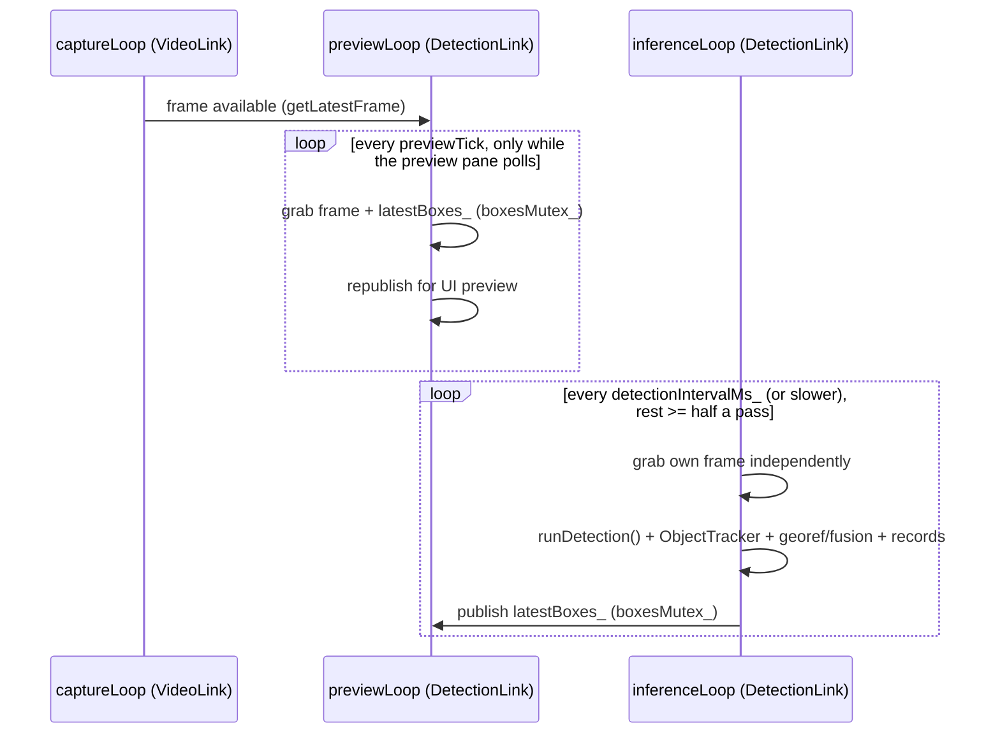

# `DetectionLink` — YOLO detection, tracking & georeferencing

**Files:** `Detectionlink.h`, `Detectionlink.cpp`, `ObjectTracker.h`, `ObjectTracker.cpp`
**Tests:** `tests/tracker_sim.cpp` (tracker simulation, old vs new),
`tests/detectionlink_run.cpp` (the real `DetectionLink` on an image, optional
`tiles`), `NNTraining/fpv_eval.py` (accuracy on our own FPV footage)
**Depends on:** OpenCV `dnn` (ONNX inference), `VideoLink` (frame source
only, via pointer — see the provider pattern), a telemetry provider
callable
**Exposed to Python as:** `DroneBackend.DetectionLink` (see
[bindings.md](bindings.md#detectionlink))

## Responsibility

Runs a YOLO object-detection model against the live video feed, without
ever slowing the pilot's live view. It then does three more things:
- **Tracks** detections across passes, so one physical object is one
  track. A parked car is one object, not 20.
- **Estimates where each object is.** Three ranging strategies, plus a
  coarse bearing + distance fallback, each with an uncertainty radius.
- **Fuses** the sightings of each object into one position whose radius
  shrinks over time.

The result is a `DetectionRecord` per object: a map pin with a "search
here" radius for the copilot.

## Wiring (decoupled sources)

- `setVideoLinkSource(VideoLink*)` — preferred. `DetectionLink` does not
  take ownership and calls nothing on the pointer except
  `getLatestFrame()`. Pixel data never crosses into Python via this path.
- `setFrameSource(std::function<cv::Mat()>)` — escape hatch for testing, or
  for a non-`VideoLink` frame source such as a recorded file during
  post-flight replay.
- `setTelemetryProvider(std::function<TelemetrySnapshot()>)` — called once
  per detection pass, immediately before inference, so the snapshot is as
  time-close to the frame as practical.

See [ARCHITECTURE.md](../ARCHITECTURE.md#3-the-provider-decoupling-pattern)
for why this is structured as callables rather than concrete dependencies.

## Configuration surface (call before `start()`, most are safe at runtime)

| Setter | Default | Purpose |
|---|---|---|
| `setModelPath(path)` | — | ONNX model path. Both Ultralytics layouts work, the end-to-end `[1, N, 6]` and the raw `[1, 4+classes, anchors]` (see "Model output layouts"). Export with `end2end=True` (`export_model.py` does). A sibling `.names` file (same stem) is auto-loaded for class labels; otherwise classes read as `class_N` |
| `setScreenshotDir(dir)` | empty (disabled) | Where detection screenshots are written; detections are still recorded without one if left empty |
| `setHorizontalFovDeg(fov)` | 90.0 | Camera horizontal FOV — must match the camera's real datasheet FOV, same assumption used for `VideoLink`'s capture config |
| `setDetectionIntervalMs(ms)` | 250 | Detection-pass cadence, independent of the ~30–60 fps capture loop |
| `setConfidenceThreshold(t)` | 0.4 (cockpit: **0.25**) | Confidence a detection needs to start a track / become a record. The cockpit uses 0.25 because on our FPV footage the model is much less confident than on the public datasets (see "Current model") |
| `setClassConfidenceThreshold(name, t)` / `clearClassConfidenceThresholds()` | none | Per-class override of the threshold above. The cockpit loads tuned values from `<model>.thresholds.json`, written by `NNTraining/fpv_eval.py` |
| `setInputSize(size)` | 640 (cockpit: 960) | Square letterboxed input side. **Must match the ONNX export's `imgsz`**, not necessarily the training `imgsz` — mismatch silently scales every box wrong with no crash. The current model is trained and exported at 960 |
| `setUseCuda(enabled)` / `isUsingCuda()` | false | Opt into CUDA backend/target; needs an OpenCV build with CUDA support (stock pip/vcpkg wheels lack it). Falls back to CPU silently if unavailable — check `isUsingCuda()` after `start()` |
| `setMaxDutyCycle(d)` | 0.66 | Max share of time the inference thread may be busy; it rests ≥ pass × (1/d − 1) after each pass |
| `setTilingBudgetMs(ms)` / `isTilingActive()` | 0 = auto | Tiled pass time above which (3× in a row) tiling suspends itself; auto = max(500 ms, 2 × interval) |
| `setTiling(enabled)` / `isTiling()` | false (cockpit: on) | Each pass also runs the model on four overlapping 60 % tiles and merges the results (`runDetection()`). Small and distant objects are seen about 1.7× larger. On the FPV reference footage, recall at confidence 0.4 went from 0.32 to 0.50 for people and from 0.72 to 0.90 for vehicles. Costs about 5× inference per pass |
| `setUseCudaFp16(enabled)` / `isUsingCudaFp16()` | true | With CUDA, try `DNN_TARGET_CUDA_FP16` first (typically 1.5–2× faster on RTX GPUs). `start()` verifies it with a dummy pass (no exception, no NaN/Inf in the output) and otherwise falls back to FP32 CUDA, then CPU |
| `setKnownObjectWidth(class, meters)` / `clearKnownObjectWidths()` | none set (cockpit: person 0.5, car 1.8, large_vehicle 2.5, motorcycle 0.8, other_vehicle 2.0) | Real-world face-on width per class, enabling object-size ranging for that class (see below). Keys must match the `.names` file exactly; a key that matches no class is silently ignored |
| `setCoarseRangeM(default, max)` | 60 / 150 m | Coarse fallback georeference (see "Position estimate"); default 0 disables it |
| `setMinGroundRayComponent(v)` | 0.12 (~7°) | At or below this ray-downward-component, ground-plane ranging is not used at all; triangulation, object size and then the coarse fallback take over (see "Georeferencing") |
| `setTriangulationMinBaselineM(m)` | 5.0 | Minimum drone movement between bearing observations before a triangulated fix is trusted |
| `setTriangulationMinBearingSpreadDeg(deg)` | 5.0 | Minimum angular spread between bearing observations — guards the "moved far but flew straight at the object" degenerate case |
| `setTrackIouThreshold(v)` | 0.1 | Minimum IoU for a box-overlap match (centre distance and appearance also match, see below) |
| `setTrackMaxMissedPasses(n)` | 6 | Minimum passes a lost track is kept — together with the lost memory, whichever is longer (slow CPU passes) |
| `setTrackLostMemoryMs(ms)` | 5000 | How long an unseen confirmed object keeps its `trackId` |
| `setTrackLowConfidence(c)` | 0.15 | Detections between this and the confidence threshold only keep a confirmed track alive |
| `setTrackConfirmHits(n)` | 2 | Passes before a new object's first record (confidence ≥ 0.70 confirms at once) |
| `setTrackReidRadiusM(m)` / `setTrackReidWindowMs(ms)` | 10 / 120000 | Geographic re-identification of an object that was out of view longer than the lost memory |
| `setTrackCameraMotionCompensation(on)` | true | Compensate drone yaw/pan between passes |
| `setTrackMoveThresholdM(m)` | 3.0 | Ground movement needed before a continuing track gets a fresh `DetectionRecord` |
| `setTrackRefreshIntervalMs(ms)` | 10000 | Even a static, continuously-tracked object gets a periodic fresh record so it doesn't look stale |

## Tiled detection (`runDetection()`)

`inferenceLoop()` calls `runDetection()`, which runs `runInference()` on the
full frame. With `setTiling(true)` it also runs on four corner tiles (60 %
of the frame each, 20 % overlap) and merges everything in frame
coordinates:

1. A tile box ending within 2 % of an **inner** tile edge is dropped,
   because the full frame or the neighbouring tile has that object whole.
2. A tile box that lies ≥ 70 % inside a larger same-class full-frame box
   is dropped as a fragment of a big object.
3. Class-aware NMS (IoU 0.5) over all boxes keeps the most confident one
   per object.

`NNTraining/fpv_eval.py --variants tiles` implements exactly the same
rules, so its measurements carry over to the cockpit. The cockpit prints
the real pass time about 20 s after the engine starts (`detection pass
… ms (tiled)`). If it's far above `DETECTION_INTERVAL_MS`, set
`DETECTION_TILING = False` in `DroneCockpitUI.py`.

## Protecting the live video

The pilot's FPV view is `VideoLink`'s own capture/paint path: an
`ABOVE_NORMAL` thread painting straight into a native window. Detection is
only for spotting objects and estimating their position, so it must never
slow that path down. These are the safeguards:

| Where | Safeguard |
|---|---|
| Frame hand-off (`VideoLink::getLatestFrame()`) | Only the frame header is taken under the capture mutex; the 4 MB pixel copy happens after the lock is released. Every captured frame lives in a fresh buffer, so the capture thread never waits for a consumer's copy |
| `inferenceLoop()` | `THREAD_PRIORITY_BELOW_NORMAL`. **Duty-cycle limit** (`setMaxDutyCycle`, default 0.66): after each pass the thread rests at least half the pass time, so a slow pass never runs back-to-back |
| Tiling | Suspends itself (`isTilingActive()` becomes false) after 3 tiled passes in a row slower than `setTilingBudgetMs` (auto: max(500 ms, 2 × interval)), and full-frame detection continues |
| `previewLoop()` | `BELOW_NORMAL`. It does no work at all unless the preview pane polled `get_latest_annotated_frame_jpeg()` within the last 2 s |
| `get_latest_annotated_frame_jpeg` binding | Resize and JPEG encode run with the GIL released, so the Tk UI never waits on them |

## Current model and its measured accuracy

| | |
|---|---|
| Model | YOLO26m, 960 px input, 5 classes (person, car, large_vehicle, motorcycle, other_vehicle). Weights in `YOLO26M model/best.pt` (44 MB, stripped); cockpit ONNX `DroneCockpitUI/models/yolo26m_main.onnx` (local, not in Git) |
| Training | 100 epochs on VisDrone + UAVDT + SARD (unified taxonomy), see `NNTraining/documentation_for_training/train.md` |
| Public val (blended) | mAP50 0.647, mAP50-95 0.387 |
| SARD **test** (never trained on) | person mAP50 0.945, P 0.946, R 0.889 |
| **Our FPV footage** (`fpv_eval.py ref`, part0 + part1 reference labels) | car AP50 0.91; vans 0.36–0.46 (often called "car"); person 0.20 at IoU 0.5 / 0.53 at IoU 0.3 (10–20 px pedestrians: boxes imprecise); vehicles merged 0.95 |

What the FPV results meant for the cockpit settings:
- **Confidence threshold 0.25.** At 0.4 only ~32 % of people and ~71 % of
  vehicles are found per frame; at 0.25 it's 46 % / 86 % at 65 % / 94 %
  precision.
- **Tiling on.** At confidence 0.4, person recall goes from 0.32 to 0.50
  and vehicle recall from 0.72 to 0.90.

The best-F thresholds on FPV are only 0.05–0.11, a domain gap between the
training data and the analog camera. A fine-tune on FPV frames is the
planned next step.

## Model output layouts

`runInference()` letterboxes the frame to `inputSize × inputSize` and
reads either ONNX layout, told apart by the output shape:

| Layout | Shape | Rows | Post-processing |
|---|---|---|---|
| End-to-end (YOLO26 default, `export_model.py`, `train.py --export-only`) | `[1, N, 6]` | `[x1, y1, x2, y2, conf, cls]`, zero-padded | none; NMS is inside the model |
| Raw (`end2end=False`) | `[1, 4+classes, anchors]` | `[cx, cy, w, h, score…]`, channel-major, sigmoid applied | class argmax, class-aware NMS (IoU 0.7, max 300; Ultralytics' `predict()` defaults) |

Any other shape is reported once on stderr and the pass is skipped. Tested
by running this `Detectionlink.cpp` against `yolo26n` exported both ways and
comparing with Ultralytics' `predict()`.

## Dual-thread design



- **`previewLoop()`** grabs a frame and republishes it — annotated with
  whatever boxes `inferenceLoop()` most recently finished — strictly on the
  fixed `kPreviewTickMs` cadence. It **never** calls `runInference()`, so it
  can never be blocked by it regardless of how slow a given
  model/build/hardware combination makes one forward pass. This is what
  gives the live preview pane the video feed's own responsiveness
  *structurally*, rather than depending on inference staying fast — the old
  single-thread version depended on exactly that assumption and broke badly
  on an unoptimized Debug build, where a several-second `runInference()`
  call blocked frame grab + republish for its entire duration.
- **`inferenceLoop()`** grabs its own frame independently, runs the model +
  tracker + record-writing at `detectionIntervalMs_` cadence (or however
  long a pass actually takes, if longer), and publishes only the resulting
  boxes for `previewLoop` to pick up.
- The two threads never block on each other beyond the brief
  `boxesMutex_` critical section. Both run at `BELOW_NORMAL` priority; see
  "Protecting the live video" for the rest of the safeguards.

## Object tracking / re-identification

Without a tracker, a car sitting in frame for 10 seconds at 4 passes/sec
(the default 250 ms interval) produces 40 near-identical
`DetectionRecord`s and screenshots. The first tracker matched each pass's
boxes to the previous pass's by IoU ≥ 0.3 and identical class only. In
flight that still logged the same object over and over:

| Situation | Why IoU-only failed |
|---|---|
| Crossing car | Between passes it moves more than its own width, so the boxes no longer overlap |
| Drone yaw / pan | The whole image shifts; even parked cars lose their overlap |
| `car` ↔ `other_vehicle` flicker | Different class → new track |
| One weak pass below the confidence threshold | Track starved, then a new one |
| Two cars / people crossing | Greedy IoU swapped identities |
| Single-pass false alarm | Recorded immediately |

`trk::ObjectTracker` (`ObjectTracker.h/.cpp`, OpenCV core + imgproc only,
no Win32, no threads) replaces it. Per pass:

1. **Camera motion.** `cv::phaseCorrelate` on a 320-px-wide grayscale copy
   of this and the previous inference frame gives the global image shift;
   every track is moved by it. The detection boxes of both passes are
   blanked out first, so a big moving vehicle isn't mistaken for a pan.
2. **Prediction.** Each track has a velocity (alpha-beta filter on real
   time, so slow CPU passes are handled) and is predicted to *now*.
3. **Association score** = IoU + centre distance in object sizes + HSV
   colour-histogram similarity, inside a gate that widens the longer the
   track has been unseen. A track seen only once has no velocity yet, so
   it gets a wide gate, but only for a detection that also looks alike.
   Greedy best-first assignment.
4. **Class groups.** Vehicle classes (`car`, `large_vehicle`,
   `motorcycle`, `other_vehicle`: any name containing car, vehicle, truck,
   bus, motor or van) may match each other with a small penalty; `person`
   only matches `person`. The class written to records and drawn on the
   preview is a confidence-weighted **vote** over the track's history.
5. **Two stages (the ByteTrack idea).** Detections ≥ the confidence
   threshold are matched first. Weaker ones (≥ `setTrackLowConfidence`)
   may then only extend a confirmed track. They never start one or create
   a record on their own.
6. **Life cycle.** *Tentative* → *confirmed* after `setTrackConfirmHits`
   matches (or at once with confidence ≥ 0.70). Only confirmed tracks are
   recorded, so single-pass false alarms never become pins. An unseen
   confirmed track is *lost*: still predicted and matchable with the same
   `trackId` for `setTrackLostMemoryMs` (and at least
   `setTrackMaxMissedPasses` passes).
7. **Geographic re-ID** (in `DetectionLink`). A lost track that expires is
   archived with its last georeferenced position, group and appearance.
   When a new track is confirmed within `setTrackReidRadiusM` of an
   archived object of the same group, with no contradicting appearance,
   inside `setTrackReidWindowMs`, it inherits the old `trackId` and
   bearing history and counts as a continuing object. A parked car the
   drone flies back over doesn't become a new pin.

On top of the tracker, `DetectionLink` keeps an `ObjectState` per track:
the public `trackId`, record-policy state and `bearingHistory`. A new
object is recorded on its first confirmed pass. A continuing one is
recorded again only once it has moved `trackMoveThresholdM_`,
`trackRefreshIntervalMs_` has elapsed, or its georeferencing appeared or
disappeared (`shouldRecordAgain()`).

`bearingHistory` gets a `BearingObservation` on **every** confirmed pass
the object is seen, whether or not that pass's own ranging succeeded. A
string of un-ranged forward-flight sightings still builds up parallax for
`rangeByTriangulation()` once the drone has moved enough (capped at
`kMaxBearingHistoryPerTrack` in the `.cpp`).

The live preview draws tentative and confirmed tracks with the voted
class. Weak detections that match nothing are dropped as noise.

### Measured (tests/tracker_sim.cpp)

The simulator renders textured ground with coloured objects, pans the
camera, and feeds the same noisy detections (jitter, misses, confidence
dips, class flicker, false alarms) to a faithful copy of the old matcher
and to the new tracker. **IDs per real object**, averaged over 5 seeds
(1.00 = perfect):

| Scenario | Old | New |
|---|---|---|
| Crossing cars, 4 Hz | 20.9 | 1.00 |
| Static objects, drone yaw/pan | 21.3 | 1.00 |
| Class flicker + confidence dips | 18.5 | 1.00 |
| Occlusion 2 s | 3.0 | 1.00 |
| Two cars passing each other (ID swaps) | 23.8 (3.2) | 1.00 (0) |
| Slow CPU passes 1.5 s + pan | 9.8 | 1.00 |
| Parking lot, 12 identical cars (ID swaps) | 3.55 (11.2) | 1.08 (0.6) |
| Fast vehicles, 2× own width per pass | 8.6 | 1.00 |
| 20 % missed detections + dips | 14.1 | 1.00 |
| Sharp drone turn | 8.8 | 1.00 |
| Pedestrians crossing, same colour | 4.5 | 1.00 |
| False alarms 0.3/pass → false records | 23.4 | 0.2 |
| Occlusion 7 s (> lost memory) | 2.0 | 2.0 (in flight, geographic re-ID covers this; not simulated) |

Cost: about 3 ms per pass for a handful of objects; the model itself takes
tens to hundreds of ms. Build and run on any machine with OpenCV:

```
cd DroneBackend/tests
g++ -std=c++17 -O2 -I.. tracker_sim.cpp ../ObjectTracker.cpp $(pkg-config --cflags --libs opencv4) -o tracker_sim
./tracker_sim
```

## Position estimate per object (search-and-rescue pin)

The goal isn't survey precision. It's a pin and a radius small enough to
send a search team: roughly 50–100 m is enough.

**Altitude.** `TelemetrySnapshot.altitudeM` must be height above the
ground. The cockpit fills it from `baro_altitude_cm`, which is relative to
the arming point on both links: Betaflight's estimated altitude over USB,
and CRSF baro over the radio, or GPS altitude minus the home altitude when
no baro arrives. It used to come from `gps.altitude_m`, which is above
*sea level* and pushed every ground-plane pin several times too far out.
Ground-plane ranging also refuses altitudes below 2 m and ground distances
over 400 m.

**Uncertainty radius (`DetectionRecord.uncertaintyM`, ~2σ, m) per method:**

| Method | Radius | When it's used |
|---|---|---|
| `ground_plane` | from altitude error (3 m + 5 %), camera-tilt error (4°) and heading error (5°). Grows quickly as the ray flattens | Camera pointing down enough, altitude ≥ 2 m |
| `triangulated` | max(10 m, 20 % of distance) | The object was seen from positions far enough apart |
| `object_size` | max(10 m, 35 % of distance) | A real-world width is configured for the class |
| **`coarse`** (fallback) | ≥ 50 m, typically 60–150 m (camera looking almost straight down: the pin is at the drone, radius max(30 m, altitude)) | **Whenever none of the above works but GPS and heading are valid**, e.g. a shallow camera angle, no altitude, or radio-link telemetry. The pin goes along the camera bearing at the ground-plane distance clamped to 150 m, or 60 m when even that is unknown (`setCoarseRangeM`). Straight down means at the drone |

So with a GPS fix every confirmed object gets a pin, and the radius says
how far to trust it.

**Fusion over sightings.** Each object (track) keeps an inverse-variance
weighted mean of all its georeferenced sightings, with a 15 s half-life so
a moving object's pin follows it. The record's latitude/longitude are this
**fused** position and `uncertaintyM` is its radius:
- The radius shrinks with more sightings, but never below half the best
  single fix, because mount and heading biases are shared between
  sightings.
- A coarse radius never shrinks, because every coarse fix uses the same
  distance guess.
- Distance, bearing and method in the record are the latest pass's own
  measurement. `distanceM` is the slant range for `ground_plane` and
  `object_size`, and the horizontal ground distance for `triangulated`
  and `coarse`.

Also new in each record: `sightings` (confirmed passes so far) and
`bestConfidence`.

**Radio vs. USB.** The estimate needs GPS position, heading (yaw), roll/
pitch and the relative altitude. All of these arrive over CRSF too, just at
lower rates (GPS about 1–5 Hz). A telemetry snapshot up to about a second
old moves the pin by at most the drone's speed × that age, small compared
with the 50–100 m target. Without a valid GPS fix there's no position at
all, and the copilot list shows "no GPS fix".

## Georeferencing: ranging strategies

All of them consume the same world-space ray, built once per detection:

`computeWorldRay(raw, frameW, frameH, telemetry, ...)` composes the pixel
offset + horizontal FOV into a camera-space ray, then applies gimbal
pan/tilt, then body roll/pitch/heading — shared by every ranging method so
they always agree on *direction* and only differ on how far along that
direction the object actually is. Angle conventions (documented explicitly
because getting one wrong offsets every pin consistently and
easy-to-miss, the same class of bug as `MagQMC5883L`'s historical
`atan2(y,x)` vs `atan2(x,y)` swap):

- `headingDeg` — compass heading, 0 = north, increasing clockwise
- `rollDeg` — positive = right wing down
- `pitchDeg` — positive = nose up
- `gimbalPanDeg` — relative to body forward, positive = pan right
- `gimbalTiltDeg` — 0 = forward/level, +90° = straight down

| Strategy | Method | Needs | Strength | Weakness |
|---|---|---|---|---|
| **Ground-plane intersection** | `rangeByGroundPlane()` | Altitude (AGL) + attitude + gimbal | Simple, works well when the gimbal is steeply downward and altitude is trustworthy | Degrades sharply as the ray flattens toward the horizon — small altitude/attitude error → huge range error (guarded by `setMinGroundRayComponent()`) |
| **Bearings-only triangulation** | `rangeByTriangulation()` | Accumulated `BearingObservation` history for the same track + the current ray | Least-squares fit; needs **no** assumed object size and **no** altitude trust at all | Degenerates (returns invalid) with only one sighting, or when the drone flew straight at the object with no lateral offset (no real parallax) — guarded by `setTriangulationMinBaselineM()` and `setTriangulationMinBearingSpreadDeg()` |
| **Apparent object size** | `rangeByObjectSize()` | A registered real-world width for that class (`setKnownObjectWidth()`) | `distance = (known width × focal length px) / (bbox width px)` — pinhole model; independent of altitude entirely, works at any gimbal angle including straight-ahead FPV shots | Only as accurate as the assumed real-world width and how face-on the object is viewed; only available for registered classes |

`computeGeoCandidate()` uses the first that works, in this order:

1. ground-plane;
2. triangulation;
3. object size;
4. otherwise the **coarse** fallback (`rangeCoarse()`): bearing plus a
   rough distance, ≥ 50 m radius, used whenever GPS and heading are valid.

Every result carries a `method` string (`"ground_plane"`, `"triangulated"`,
`"object_size"`, `"coarse"`) and an uncertainty radius, both stored on the
`DetectionRecord`, so a reviewer can tell how much to trust a given pin.
See "Position estimate per object" above for the radius model and the
per-object fusion.

Flat-earth assumption is used throughout (`rangeByGroundPlane`) — explicitly
called out as fine at the few-km ranges this is designed for, with a DEM
lookup left as a possible future addition if slope error starts to matter.

## `TelemetrySnapshot` and `DetectionRecord`

`TelemetrySnapshot` (defined here, shared with `VideoLink`'s OSD — see
[videolink.md](videolink.md#software-osd-overlay)) carries position,
attitude, gimbal angles, and a set of OSD-only fields (battery, RSSI, GPS
fix/sat count, home distance, ground speed, armed) that `DetectionLink`
itself never reads — they ride along purely because `VideoLink` reuses this
one struct instead of inventing a second telemetry type.

`DetectionRecord` is the map-pin record. It holds:
- **Identity and timing:** `id`, `trackId` (one per physical object) and
  the timestamp.
- **Class and confidence:** the voted class, this pass's `confidence` and
  the object's `bestConfidence`.
- **Sightings:** confirmed passes so far.
- **The pixel-space box**, kept so a screenshot can be re-cropped or the
  ray re-derived later.
- **Position:** the **fused** lat/lon, the `georeferenced` flag and the
  `uncertaintyM` radius, plus this pass's own `rangeMethod`, `distanceM`
  (slant or horizontal, see "Fusion over sightings") and `bearingDeg`.
- **An optional `screenshotPath`.**
- **The full `telemetry` snapshot**, stored verbatim for later
  re-derivation or debugging.

A record is written when an object is first confirmed, when its fused
position has moved `trackMoveThresholdM`, and every
`trackRefreshIntervalMs`. So several records can belong to one object; the
copilot UI groups them by `trackId` into one row.

## Live preview exception

`getLatestAnnotatedFrameJpeg()` JPEG-encodes (at most 640 px wide) the
latest captured frame with the most recent detection pass's boxes drawn on
it; `previewLoop()` redraws that frame every 40 ms. This is a
**deliberate, narrow** exception to the "raw pixel data never crosses into
Python" rule — intended only to feed the optional preview pane in the
detection window (`DetectionMapWidget` polls it every 40 ms while the pane
is on), **not** the pilot's primary video path (that stays on
`VideoLink`/its native render window exactly as documented in
[videolink.md](videolink.md)). Costs one resize + JPEG encode per call,
done with the GIL released. The preview thread only produces frames while
this function is being polled (nothing in the last 2 s means idle).

## Reading detection results from Python

- `getAllRecords()` — full copy of every record since `start()` or the last
  `clearRecords()`. Mutex-protected; fine at UI refresh rate (a few Hz),
  not meant to be called every frame. Screenshots are written outside
  that mutex, so a poll never waits on disk I/O.
- `getRecordsSince(sinceId)` — incremental poll (pass 0 for everything) so
  the UI doesn't have to re-render the whole pin list every tick.
- `getFrameIndexSince(sinceMs)` — the **frame index**: one `FrameIndexEntry`
  per detection pass (`timestampMs`, and the `trackIds`/`classNames` of the
  confirmed objects in that frame), oldest first. Records are only written
  when an object is new, moved or on a refresh, so they cannot tell which
  objects were visible together; the frame index can, and the detection
  window's scene search ("frames with ≥ 2 persons at once") runs on it.
  The last 50,000 passes (~3.5 h at 4 Hz) are kept; `clearRecords()`
  clears it too.
- `getDetectionCount()`, `getLastPassDurationMs()`,
  `getLastPassTimestampMs()` — cheap atomics, safe to poll at UI rate.
